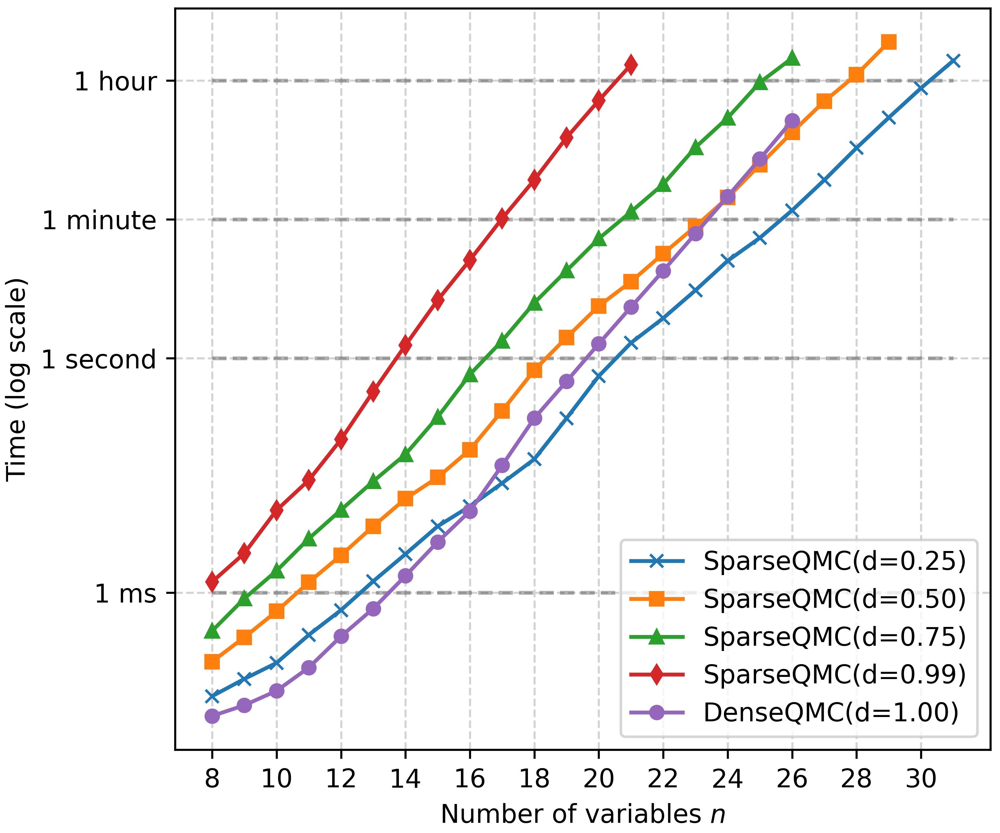

# DenseQMC: an efficient bit-slice implementation of the Quine-McCluskey algorithm

This repository contains an optimized bit-slice implementation of the Quine-McCluskey algorithm (for dense functions), as well as optimize classic Quine-McCluskey algorithm (for sparse functions). It covers the first step of the QMC algorithm - finding all prime implicants of the function (patterns like `01*11**0*` with maximal number of stars, fully included in the described set). It is used to obtain small DNF or CNF formulas for a given Boolean function.

**Important:** as the second part of the QMC method is not covered, the output formula will not directly have minimal size. Minimization requires solving a hard SetCover problem (NP-Complete), typically of a large size, and thus is feasible only for smaller values of `n`. Consider the [optimodel](https://github.com/hellman/optimodel) tool which includes some algorithms (integer optimization, heuristic greedy variants) to do that (for CNF/DNF/MILP models).



**License:** MIT

**Note:** this is an early version, results of this implementation were not cross-tested with other tools, please make the necessary verifications.


## Computing prime CNF/DNF clauses

The implementations must first be compiled (requires a C++ compiler):

```sh
$ make
```

Then, you can use one of the programs `./denseqmc`, `./sparseqmc` or `./sparseqmcext`. DenseQMC requires 12 GiB of RAM for $n=23$ (triples for each increase of n), 1 TiB of RAM for $n=27$, independently of the input function's density. SparseQMC may requires less if the instance is not too dense (in the DNF mode). In particular, SparseQMC seems to be better even for instances with 50% density but after $n\approx24$. The limits on the number $n$ of variables are $n=27$ for `denseqmc` (requires 1 TiB of RAM), $n=31$ for `sparseqmc` (due to internal structures), $n=63$ for `sparseqmcext`. Note that the two SparseQMC programs require RAM depending on the density of the function, and for the CNF case the density is flipped and requires computing the full truth table of the function ($2^n$ elements). In other words, computing a CNF of sparse functions is slower and needs more RAM.

Both programs take as input two arguments:
```sh
$ ./denseqmc <file.in> [file.out]
$ ./sparseqmc <file.in> [file.out]
$ ./sparseqmcext <file.in> [file.out]
```

The input file has the following format:
- The first line should contain the format letter and the dimension $n$:
  `d` - usual Quine-McCluskey (DNF mode)
  `c` - complement the input set (CNF mode)
- Each consequent line should consist of a bitstring of length $n$, containing only ASCII '0' or '1' characters.

Example:

```
d 5
00000
00010
01000
01010
00100
```

The output file (stdout if not provided) follows the DIMACS format (adapted to the DNF case), with 0 instead of the actual number of clauses due to implementation issues. For example:

```
p dnf 3 0
-1 -2 -3 0
1 3 0
2 3 0
```

Each line (after the header) defines a single clause by specifying variable index (1-based) and variable negation by index negation. E.g. -2 means (NOT x2) and 3 means (x3). The line is finished by the 0 symbol as the separator. The example above describes the DNF formula $x_1'x_2'x_3' \lor x_1x_3 \lor x_2x_3$.

Running example:

```sh
$ cat tests2/cnf_and.in                                                                                                                                                                                                                (base)
c 3
000
010
100
111

$ ./denseqmc tests2/cnf_and.in                                                                                                                                                                                                         (base)
n = 3 mode = c (CNF)
bitslice alg needs RAM: 0.00 GiB
input size: 4/8 (density: 0.5%)
input checksum: c1c4e72ea429ad61
start n = 3
finished dense part
p cnf 3 0
1 -3 0
-1 -2 3 0
2 -3 0
output checksum: cff7ffdafc1f800b
out size: 3
used RAM: 0.00 GiB
```


## Benchmarking

The benchmarking tools `./benchmark_denseqmc` and `./benchmark_sparseqmc` requires two parameters: the number of bits `n` and the density `d` in percents, 1 <= n <= 31 and 0 <= d <= 100.

Example:

```sh
$ /usr/bin/time -v ./benchmark_sparseqmc 24 10
n = 24 density = 10%
bitslice alg needs RAM: 35.30 GiB
widening hash space from 20 to 25 bits
checksum: cbc104c5d92ec573
inp size: 1676436
start n = 24
weight 0 new minterms 2011003
widening hash space from 20 to 22 bits
weight 1 new minterms 116186
weight 2 new minterms 44
weight 3 new minterms 0
checksum: 068e3a0c00b8c102
out size: 1844240
used RAM: 0.32 GiB  # memory usage (algorithm's view)
	Command being timed: "./benchmark_sparseqmc 24 10"
	User time (seconds): 1.76
	System time (seconds): 0.09
	Percent of CPU this job got: 99%
	Elapsed (wall clock) time (h:mm:ss or m:ss): 0:01.86
	Average shared text size (kbytes): 0
	Average unshared data size (kbytes): 0
	Average stack size (kbytes): 0
	Average total size (kbytes): 0
	Maximum resident set size (kbytes): 369212  # total memory usage (system view)
	Average resident set size (kbytes): 0
	Major (requiring I/O) page faults: 0
	Minor (reclaiming a frame) page faults: 107075
	Voluntary context switches: 1
	Involuntary context switches: 4
	Swaps: 0
	File system inputs: 0
	File system outputs: 0
	Socket messages sent: 0
	Socket messages received: 0
	Signals delivered: 0
	Page size (bytes): 4096
	Exit status: 0
```